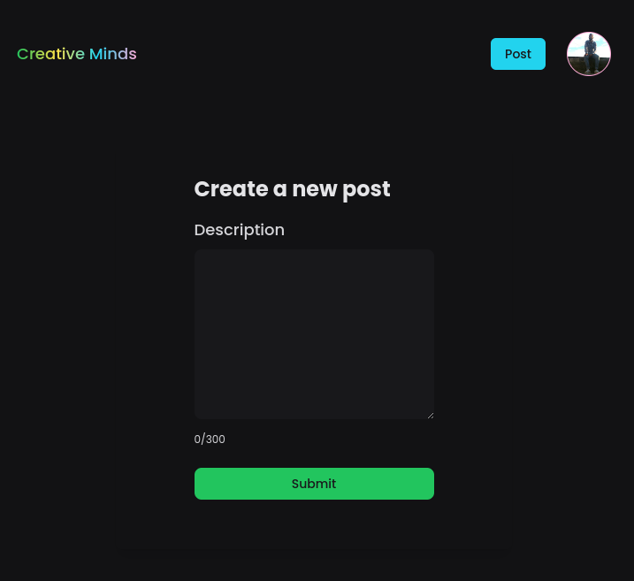

<h1 align="center">
  Creative Minds
</h1>

# Screens
<p align="center">
  
  
  
  
  
</p>

## Technologies used

- [NextJs](https://nextjs.org/)
- [Typescript](https://www.typescriptlang.org)
- [Tailwindcss](https://tailwindcss.com/)
- [Firebase Auth](https://firebase.google.com/docs/auth)
- [Firebase Firestore](https://firebase.google.com/docs/firestore)

## Projeto

Um mini blog, tipo Tweeter, onde você pode inserir até 300 caracteres,
editar e deletar seu post.


## Requirements

You need to install both [Node.js](https://nodejs.org) and [Yarn](https://yarnpkg.com) or npm to run this project.

## How to use it

```bash
  # Install the dependencies
  $ yarn install
  # Run the web server
  $ yarn dev
```

The app will be available for access on your browser at (http://localhost:3000)
